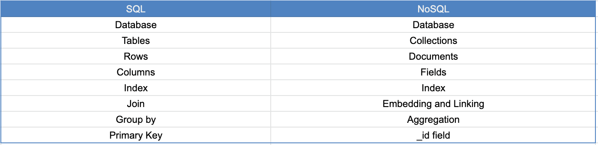

## 简介
>Python是一种解释型脚本语言，所以不需要编译,自带Python Shell等待用户输入代码逐行解释运行code
-- python 交互脚本
```
py.exe
python shell code

7//2(3) # 移除余数
5**2 # 指数
```
## [pyenv 管理py版本号](https://github.com/pyenv/pyenv)
- Windows 安装pyenv已存在python安装方法
```
pip install pyenv-win --target C:\\Users\\aren\\.pyenv
```
- 升级pyenv
  - 在python的安装目录中找到\site-packages\easy_install.pth file 如果没有的话就新建一个 增加pyenv的安装路径 C:\%USERPROFILE%\.pyenv

- 未安装过python安装方法
```
Invoke-WebRequest -UseBasicParsing -Uri "https://raw.githubusercontent.com/pyenv-win/pyenv-win/master/pyenv-win/install-pyenv-win.ps1" -OutFile "./install-pyenv-win.ps1"; &"./install-pyenv-win.ps1"
```


## 基础语法
- 以空格来区分代码块
>代码注释
- 单行注释以 # 号开头
- 多行注释以三引号开始
```
"""This is multiline comment
multiline comment takes multiple lines.
python is eating the world
"""
```

## 基础类型
### 数字型
- 整型(x=5)、浮点型(y=3.14)、Complex(Example 1 + j, 2 + 4j)
复数相乘的运算口诀："实部相乘，虚部相加"
复数除法转化为乘法，我们可以使用如下的技巧。将除数 b 的共轭复数乘以分子和分母的积，然后将除数和它的共轭复数相乘。也就是说，我们可以将 c 表示为：
```python
a = x1 + y1j
b = x2 + y2j

c = a/b = (x1 + y1j) * (x2 - y2j) / (x2^2 + y2^2)
```
### 字符串类型
(name="john")/(name='john')/(name="""john""")多行字符串是通过使用三重单引号 (''') 或三重双引号 (""") 创建的,python中的转义字符串
```
\n: new line
\t: Tab means(8 spaces)
\\: Back slash
\': Single quote (')
\": Double quote (")
```
- 格式化字符串
  - 旧式字符串格式（% 运算符：%s - 字符串（或任何具有字符串表示形式的对象，如数字）；%d - 整数；%f - 浮点数；"%.number of digitsf" - 具有固定精度的浮点数
  - 新样式字符串格式 (str.format)，另一种新的字符串格式是字符串插值，f-strings。字符串以 f 开头，我们可以在其对应的位置注入数据。
- 字符串作为字符序列
  - 解包字符:a,b,c,d='Pyth'
  - 按索引访问字符串中的字符,在编程中计数从零开始。因此，字符串的第一个字母索引为零，字符串的最后一个字母是字符串的长度减一, `print('Pt'[-1])`
  - 字符串切片`first_three = language[0:3] # starts at zero index and up to 3 but not include 3`
  - 字符串反转 `greeting = 'Hello, World! print(greeting[::-1]) # !dlroW ,olleH`
  - 切片时跳过字符 `language = 'Python'
pto = language[0:6:2] #
print(pto) # Pto`
- 字符串的方法
  1. capitalize()：将字符串的第一个字符转换为大写字母
  2. count()：返回子字符串在字符串中出现的次数，count(substring, start=.., end=..)。 start 是用于计数的起始索引，end 是要计数的最后一个索引。
  3. endswith()：检查字符串是否以指定结尾结尾
  4. expandtabs()：用空格替换制表符，默认制表符大小为6,也可以指定空格大小
  5. find()：返回第一次出现的子串的索引，如果没有找到则返回-1
  6. format()：将字符串格式化为更好的输出
  7. index()：返回子字符串的最低索引，附加参数指示开始和结束索引（默认 0 和字符串长度 - 1）。如果未找到子字符串，则会引发 valueError。
  8. rindex()：返回子字符串的最高索引，附加参数指示起始和结束索引（默认 0 和字符串长度 - 1）
  9. isalnum()：检查字母数字字符
  10. isalpha()：检查所有字符串元素是否都是字母字符（a-z 和 A-Z）
  11. isdecimal()：检查字符串中的所有字符是否都是十进制（0-9）
  12. isdigit()：检查字符串中的所有字符是否都是数字（0-9 和一些其他数字的 unicode 字符）
  13. isnumeric()：检查字符串中的所有字符是否都是数字或数字相关（就像 isdigit() 一样，只接受更多符号，如 ½）
  14. isidentifier()：检查一个有效的标识符——它检查一个字符串是否是一个有效的变量名
  15. islower()：检查字符串中的所有字母字符是否均为小写
  16. isupper()：检查字符串中的所有字母字符是否都是大写
  17. join()：返回一个连接的字符串
  18. strip()：从字符串的开头和结尾删除所有给定的字符
  19. replace()：用给定的字符串替换子字符串
  20. split()：拆分字符串，使用给定的字符串或空格作为分隔符
  21. title()：返回标题大小写的字符串
  22. swapcase()：将所有大写字符转换为小写，将所有小写字符转换为大写字符
  23. startswith()：检查字符串是否以指定字符串开头

### Booleans类型
(is_raining=True)布尔数据类型表示两个值之一：True 或 False。
### List
- 有序集合在集合中能存取不同的数据类型,是一个有序且可变（modifiable）的集合。允许重复成员,fruits = ["apple", "banana", "cherry"]
  - 使用正索引访问列表项
  
  - 对list进行解包 `lst = ['item','item2','item3', 'item4', 'item5'] first_item, second_item, third_item, *rest = lst`
  - 对索引进行切片,正向索引访问可以通过指定开始、结束和步骤来指定一系列正索引，返回值将是一个新列表。`web_techs[1:3:2]`，负向索引访问可以通过最后一个元素指定为（-1）开始、结束和步骤来指定负索引的范围，返回值将是一个新列表`web_techs[-7:-1:2]`
  - 对有序集合进行更改`web_techs[0]='XAML'`
  - 判断一个元素有没有在集合中 `exist_css = 'CSS' in web_techs`
  - 要将元素添加到现有列表的末尾，我们使用方法 append()`web_techs.append('HTML')`
  - 我们可以使用 insert() 方法在列表中的指定索引处插入单个项目。请注意，其他项目向右移动。 insert() 方法有两个参数：索引和要插入的项目。`web_techs.insert(1,'MVVM')`
  - remove 方法从列表中删除指定的项目 `web_techs.remove('MVVM')`
  - pop() 方法删除指定的索引（如果未指定索引，则删除最后一项）`web_techs.pop(-1)`
  - del 关键字删除指定索引，也可用于删除索引范围内的项目。它还可以完全删除列表 `del web_techs[0:3]`
  - clear() 方法清空列表 `web_techs.clear()`
  - 可以通过以下方式将列表重新分配给新变量来复制列表：list2 = list1。现在，list2 是 list1 的引用，我们对 list2 所做的任何更改也会修改原始 list1。但是在很多情况下，我们不喜欢修改原始文件，而是希望有一个不同的副本。避免上述问题的一种方法是使用 copy()。
  - 有几种方法可以加入或连接两个或多个列表
    - 加号运算符 (+)
    - 使用 extend() 方法加入 extend() 方法允许在列表中附加列表。`web_techs.extend(copy_web_techs)`
  - count() 方法返回一个项目在列表中出现的次数 `print(web_techs.count('VUE'))`
  - index() 方法返回列表中项目的索引 `web_techs.index('VUE')`
  - reverse() 方法反转列表的顺序 `web_techs.reverse()`
  - 要对列表进行排序，我们可以使用 sort() 方法或 sorted() 内置函数。 sort() 方法按升序对列表项重新排序并修改原始列表。如果 sort() 方法 reverse 的参数等于 true，它将按降序排列列表 'web_techs.sort()',sort()：此方法修改原始列表;sorted()：返回有序列表，不修改原列表
  - 我们可以使用 in 检查元组中是否存在一个项目，它返回一个布尔值
  - 我们可以使用 + 运算符连接两个或多个元组
  - 不可能删除元组中的单个项目，但可以使用 del 删除元组本身

- 列表理解是一种从序列创建列表的紧凑方法。这是创建新列表的捷径。列表理解比使用 for 循环处理列表要快得多 `# syntax [i for i in iterable if expression]`
```
# it is possible to make a list of tuples
numbers = [(i,i**2) for i in range(11)]
print(numbers)
```
  - 列表理解可以与 if 表达式结合使用 `positive_even_numbers = [i for i in numbers if i%2==0 and i>0]`
  - Lambda 函数是一个没有名字的小型匿名函数。它可以接受任意数量的参数，但只能有一个表达式。 Lambda 函数类似于 JavaScript 中的匿名函数。当我们想在另一个函数中编写一个匿名函数时，我们需要它。要创建 lambda 函数，我们使用 lambda 关键字后跟一个参数，再后跟一个表达式。请参阅下面的语法和示例。 Lambda 函数不使用 return 但它显式返回表达式。
  ```
  # syntax
x = lambda param1, param2, param3: param1 + param2 + param2
print(x(arg1, arg2, arg3))
  ```
  - 在另一个函数中使用 lambda 函数
  ```
  # using lambda in another function
def power(x):
    return lambda n:x**n

print(power(2)(5))

  ```
### Tuple
- 元组和List一样是个有序集合,允许重复成员但一旦定义就不能更改:numbers = (1, 2, 3)
  - 创建元组`empty_tuple = (); empty_tuple = tuple()`
  - 元组元素的个数 `len(set_2_tuple)`
  - 通过索引访问元组元素 `set_2_tuple[-3]`
  
  
  - 对元组进行切片 `set_2_tuple[-2:-1]`
  - 我们可以将元组更改为列表，将列表更改为元组。元组是不可变的，如果我们想修改元组，我们应该将其更改为列表。
### Set
集合用于存储唯一项，可以找到集合之间的并集、交集、差集、对称差集、子集、超集和不相交集。集合是个无序集合，不允许重复，无法通过索引访问且成员定义就不可以更改，但可以向集合中添加新项: colors = {"red", "green", "blue"}
- 创建集合我们使用大括号 {} 来创建一个集合或 set() 内置函数 `empty_set = set()`
- 要检查一个项目是否存在于 `'HTML' in web_techs`
- 一旦创建了一个集合，我们就不能更改任何项目，我们也可以添加额外的项目 `web_techs.add('VUE')`
- 使用 update() 添加多个项目 update() 允许将多个项目添加到集合中,update() 接受一个列表参数 `web_techs.update(other_web_techs)`
- 我们可以使用 remove() 方法从集合中删除一个元素。如果找不到该元素，remove() 方法将引发错误，因此最好检查该元素是否存在于给定的集合中。但是，discard() 方法不会引发任何错误 `web_techs.remove('HTML')` `web_techs.discard('HTML')`
- pop() 方法从列表中随机删除一个项目，并返回删除的项目 `print(web_techs.pop())`
- 如果我们想清除或清空集合，我们使用 clear 方法 `web_techs.clear()`
- 如果我们想删除集合本身，我们使用 del 运算符
- 我们可以将列表转换为集合，并将集合转换为列表。将列表转换为集合会删除重复项，并且只会保留唯一的项目 `web_techs_list = list(web_techs) web_techs = set(web_techs_list)`
- 我们可以使用 union() 或 update() 方法连接两个集合,重复元素仅保留一个 `fruits.union(vegetables)`
- 交集返回两个集合中的一组项目 `inter_section = fruits.intersection(vegetables)`
- 一个集合可以是其他集合的子集或超集 `is_sub_set = inter_section.issubset(fruits)`
- 检查两个集合之间的差异 `fruits.difference(inter_section)`
- 对称差：将两个集合分别做差集，再将这两个差集去重合并起来，得到一个新的集合，包含两个集合中互不相交的元素 `fruits.symmetric_difference(inter_section)`
- 如果两个集合没有一个或多个共同项，我们称它们为不相交的集合。我们可以使用 isdisjoint() 方法检查两个集合是联合的还是不相交的 ``


### 字典
- 字典是无序的、可修改的（可变的）配对（键：值）数据类型的集合 `person = {"name": "John", "age": 36}`
  - 要创建字典，我们使用花括号、{} 或 dict() 内置函数 `empty_dict = dict()`
  - len(dct)它检查字典中“键：值”对的数量
  - 我们可以通过引用其键名来访问 Dictionary 项,如果键不存在，则通过键名访问项目会引发错误。为避免此错误，我们首先必须检查密钥是否存在，或者我们可以使用 get 方法。如果键不存在，则 get 方法返回 None，这是一个 NoneType 对象数据类型 `print(person.get('skills'))`
  - 我们可以向字典中添加新的键值对 `person['city']='Shenzhen'
    person['skills'].append('HTML')`
  - 更改集合 `person['first_name']='Ely'`
  - 我们使用 in 运算符来检查字典中是否存在键 `print('first_name' in person)`
  - 从字典中删除键值对
    - pop(key)：删除具有指定键名的项目 `person.pop('city')`
    - popitem()：删除最后一项 `person.popitem()`
    - del：删除具有指定键名的项目 `del person['last_name']`
  - items() 方法将字典更改为元组列表 `person_list = person.items()`
  - 如果我们不想要字典中的项目，我们可以使用 clear() 方法清除它们 `person.clear()`
  - 如果我们不使用字典，我们可以完全删除它 `del person`
  - 我们可以使用 copy() 方法复制字典。使用副本我们可以避免原始字典的变异 `person_copy = person.copy()`
  - keys() 方法给我们一个字典的所有键作为列表 `person_keys = person.keys()`
  - values 方法给我们一个字典的所有值作为一个列表 `person_values = person.values()`

### 类型判断
type("1+1i")

### 类型转换
将一种数据类型转换为另一种数据类型。我们使用int(), float(), str(), list, set 进行算术运算时，字符串数字要先转为int或float，否则会返回错误。如果我们连接一个数字和一个字符串，首先应该将数字转换为字符串。我们将在字符串部分讨论连接。

### 变量
变量不能以数字开头，并且不能包括特殊字符和连字符,命令规则为
1. 变量名必须以字母或下划线字符开头
2. 变量名不能以数字开头
3. 变量名称只能包含字母数字字符和下划线（A-z、0-9 和 _）
4. 变量名区分大小写（firstname、Firstname、FirstName 和 FIRSTNAME 是不同的变量）

用snake_case命名变量 `my_variable`，在一行中声明多个变量
```
first_name, last_name, country, age, is_married = 'Asabeneh', 'Yetayeh', 'Helsink', 250, True
```

### 操作符
赋值运算符用于为变量赋值,下表显示了不同类型的 python 赋值运算符

```
x=3
x>>=1
print(x)
x<<=3
print(x)
x^=3
print(x)
x&=3
print(x)
x|=3
print(x)
```

算术运算符

比较运算符

逻辑操作符

### 条件语句
条件执行，如果某个表达式为真，将执行一个或多个语句块
- if 条件关键字 if 用于检查条件是否为真并执行块代码，记住冒号后的缩进
- 速记 ` code if condition else code`
- If 条件和逻辑运算符 `if a>0 and a%2==0:`

### 循环语句
为了处理重复性任务，编程语言使用循环。 Python编程语言还提供了两种循环类型：`while loop` `for loop`
- while 循环它用于重复执行语句块，直到满足给定条件
- Break当我们想退出或停止循环时，我们使用 break
```Python
count=0
while count<5:
    if(count>3):
        break
    print(count)
    count+=1
```
- for 关键字用于构成 for 循环，与其他编程语言类似，但语法有所不同,循环用于迭代序列（即列表、元组、字典、集合或字符串)
- Continue：当我们想跳过循环迭代中的某些步骤时，我们使用Continue
- range() 函数用于数字列表。 range(start, end, step) 采用三个参数：starting、ending 和 increment。默认情况下它从 0 开始，增量为 1。范围序列至少需要 1 个参数（结束）。使用范围创建序列
- 我们可以写pass这个词来避免错误。我们也可以将它用作占位符，用于未来的陈述
```Python
for num in range(3):
    pass
    print(num)
    pass
```

### 函数
函数是设计用于执行特定任务的可重用代码块或编程语句。为了定义或声明一个函数，Python 提供了 def 关键字 `def function_name():` 函数可以不带参数声明,函数也可以有返回值，如果一个函数没有return语句，那么这个函数的值为None
- 在一个函数中，我们可以传递不同的数据类型（数字、字符串、布尔值、列表、元组、字典或集合）作为参数
  - 单参数：如果我们的函数接受一个参数，我们应该用一个参数调用我们的函数 `def single_parameter_function(name):`
  - 两个参数：一个函数可能有也可能没有一个或多个参数 `def two_parameter_funtion(first_name,last_name):`
  - 用键和值传递参数，参数的顺序并不重要 `two_parameter_funtion(last_name='you',first_name='go')`
  - 如果我们不使用函数返回值，那么我们的函数默认返回 None。要使用函数返回值，我们使用关键字 return 后跟我们要返回的变量。我们可以从函数返回任何类型的数据
  - 有时我们在调用函数时将默认值传递给参数。如果我们在调用函数时不传递参数，将使用它们的默认值`def weight_of_object(mass,gravity=9.81):`
  - 如果我们不知道传递给函数的参数数量，我们可以通过在参数名称前添加 * 来创建一个可以接受任意数量参数的函数`def sum_all_num(*nums):`
  - 作为另一个函数的参数的函数
```Python
  def square_number(n):
    return n*n
def do_something(f,x):
    return f(x)
print(do_something(square_number,5))
```

### 模块
模块是包含一组代码或一组功能的文件，可以包含在应用程序中。模块可以是包含单个变量、函数或大型代码库的文件,为了创建一个模块，我们在 python 脚本中编写代码并将其保存为 .py 文件,要导入文件，我们仅使用 import 关键字和文件名 `import mymodule
print(mymodule.generate_full_name('simen','your'))`,我们可以在一个文件中有很多函数，我们可以不同地导入所有函数 `from mymodule import generate_full_name,sum_all_numbers`; 在导入过程中，我们可以重命名模块的名称 `from mymodule import generate_full_name as fullname,sum_all_numbers as total`
- 与其他编程语言一样，我们也可以通过使用关键字 import 导入文件/函数来导入模块。让我们导入我们大部分时间都会使用的公共模块。一些常见的内置模块：math、datetime、os、sys、random、statistics、collections、json、re
  - 使用 python os 模块可以自动执行许多操作系统任务。 Python 中的 OS 模块提供了创建、更改当前工作目录、删除目录（文件夹）、获取其内容、更改和识别当前目录的功能 `print(os.getcwd())`
  - sys 模块提供了用于操作 Python 运行时环境的不同部分的函数和变量。函数 sys.argv 返回传递给 Python 脚本的命令行参数列表。此列表中索引 0 处的项目始终是脚本的名称，索引 1 处的项目是从命令行传递的参数 `print('Welcome {}. enjoy {} challenge!'.format(sys.argv[0],sys.argv[1]))`
  - Statistics Module统计模块提供数值数据的数理统计功能。此模块中定义的流行统计函数：均值、中值、众数、标准差等
  - 数学模块我们导入了数学模块，其中包含许多可以帮助我们进行数学计算的函数。要检查模块有哪些功能，我们可以使用 help(math) 或 dir(math) `from math import pi as  PI`
  - 字符串模块是一个有多种用途的有用模块 `print(string.ascii_letters)`
  - random 模块，它给我们一个介于 0 和 0.9999 之间的随机数 `print(randint(5,12))`

### List Comprehension
1. Python 中的列表理解是一种从序列创建列表的紧凑方法。这是创建新列表的捷径。列表理解比使用 for 循环处理列表要快得多
```
positive_even_numbers = [i for i in numbers if i%2==0 and i>0]
```
2. Lambda 函数是一个没有名称的小型匿名函数。它可以采用任意数量的参数，但只能有一个表达式。 Lambda 函数类似于 JavaScript 中的匿名函数。当我们想在另一个函数中编写匿名函数时，我们需要它
```
lambda_add_two_nums = lambda a,b:a+b
print(lambda_add_two_nums(2,3))
```

### 高阶函数
在 Python 中，函数被视为一等公民，允许您对函数执行以下操作：
1. 一个函数可以将一个或多个函数作为参数
```
def sum_numbers(nums):
    return sum(nums)
def high_order_function(f,listnums):
    return f(listnums)
print(high_order_function(sum_numbers,[1,2,3]))
```
2. 一个函数可以作为另一个函数的结果返回
```
def square(x):
    return x**2
def cube(x):
    return x**3
def absolute(x):
    if(x>=0):
        return x
    else:
        return -x
def higher_order_ret_function(function_name):
    if(function_name=='square'):
        return square
    elif(function_name=='cube'):
        return cube
    elif(function_name=='absolute'):
        return absolute
result = higher_order_ret_function('cube')
print(result(3))
```
3. 可以修改一个函数
4. 函数可以赋值给变量

### Python Closures
Python 允许嵌套函数访问封闭函数的外部作用域。这就是所谓的闭包。让我们看看 Python 中的闭包是如何工作的。在Python中，闭包是通过将一个函数嵌套在另一个封装函数中然后返回内部函数来创建的。
```
def add_ten():
    ten = 10
    def add(num):
        return num+ten
    return add
closure_result=add_ten()
print(closure_result(5))
print(closure_result(10))
```
### Python 装饰器
装饰器是 Python 中的一种设计模式，允许用户向现有对象添加新功能，而无需修改其结构。装饰器通常在定义要装饰的函数之前调用。
在 Python 中，装饰器是一种实现装饰器模式的语言特性。通过定义一个装饰器函数，可以将其应用于其他函数或类，从而为它们添加新的功能。例如，可以使用装饰器来实现日志记录、性能分析、缓存等功能。
```
def uppercase_decorator(function):
    def wrapper():
        func = function()
        make_uppercase = func.upper()
        return make_uppercase
    return wrapper
@uppercase_decorator
def greeting():
    return 'Welcome to Python'
print(greeting())
```
  1. 将多个装饰器应用于单个函数
  ```
  # frist decorator
def uppercase_decorator(function):
    def wrapper():
        func = function()
        make_uppercase = func.upper()
        return make_uppercase
    return wrapper
@uppercase_decorator
def greeting():
    return 'Welcome to Python'
print(greeting())
# second decorator
def split_string_decorator(function):
    def wrapper():
        func=function()
        splitted_string=func.split()
        return splitted_string
    return wrapper
@split_string_decorator
@uppercase_decorator
def mul_greeting():
    return 'Welcome to Python'
print(mul_greeting())
  ```
  2. 在装饰器函数中接受参数
  ```
  def decorator_with_parameters(function):
    def wrapper_accepting_parameters(para1,para2,para3):
        function(para1,para2,para3)
        print("I live in {}".format(para3))
    return wrapper_accepting_parameters
@decorator_with_parameters
def print_full_name(first_name, last_name, country):
    print("I am {} {}. I love to teach.".format(
        first_name, last_name, country))
print_full_name("Asabeneh", "Yetayeh",'Finland')
  ```
### 内置高阶函数
我们在本部分中介绍的一些内置高阶函数是map()、filter 和reduce。 Lambda 函数可以作为参数传递，Lambda 函数的最佳用例是在 map、filter 和 reduce 等函数中。
- map() 函数是一个内置函数，它接受一个函数和可迭代对象作为参数。
```
numbers = [1,2,3,4,5] # iterable
def square(x):
    return x**2
numbers_square = map(square,numbers)
print(list(numbers_square))
numbers_lambda = map(lambda x:x**2,numbers)
print(list(numbers_lambda))
```
map 实际上所做的是迭代列表。例如，它将名称更改为大写并返回一个新列表。
- filter() 函数调用指定的函数，该函数为指定的可迭代（列表）的每个项目返回布尔值。它过滤满足过滤条件的项目。
```
def is_odd(num):
    if num%2!=0:
        return True
    else:
        return False
odd_numbers=filter(is_odd,numbers)
print(list(odd_numbers))
```
- reduce() 函数在 functools 模块中定义，我们应该从该模块导入它。与映射和过滤器一样，它需要两个参数，一个函数和一个迭代器。但是，它不会返回另一个可迭代对象，而是返回单个值
```
from functools import reduce
numbers_str = ['1','2','3','4','5']
def add_two_nums(x,y):
    return int(x)+int(y)
total = reduce(add_two_nums,numbers_str)
print(total)
```

### 错误类型
- SyntaxError(语法错误)
- NameError
- ModuleNotFoundError
```Python
 import maths
Traceback (most recent call last):
  File "<stdin>", line 1, in <module>
ModuleNotFoundError: No module named 'maths'
```
- AttributeError
- KeyError
```
 user = {'name':'go','age':21,'country':'hk'}
>>> user['name']
'go'
>>> user[county]
Traceback (most recent call last):
  File "<stdin>", line 1, in <module>
NameError: name 'county' is not defined
```
- TypeError
```Python
 pow(5,3)
125.0
>>> power(1,3)
Traceback (most recent call last):
  File "<stdin>", line 1, in <module>
NameError: name 'power' is not defined
```
- ValueError ` int('2a')`
- ZeroDivisionError
```Python
 1/0
Traceback (most recent call last):
  File "<stdin>", line 1, in <module>
ZeroDivisionError: division by zero
```
### Python datetime
Python 有 datetime 模块来处理日期和时间,使用 strftime 方法格式化日期时间
```Py
import datetime
from datetime import datetime
print(dir(datetime))
now = datetime.now()
print(now.strftime('%H:%M:%S'))
```
[!img](./assets/strftime.png)

- 使用 strptime 将字符串转换为时间
```Py
date_str = '2023/06/26'
date_object = datetime.strptime(date_str,'%Y/%m/%d')
print(date_object)
```
- 使用日期时间中的日期 `d= date(2023,6,23) print(d.today())`
- 表示时间的时间对象 `time_value = time(12,23,20)`
- 两个时间点之间的差异使用
```Py
today = date(2023,6,26)
new_year = date(2024,6,26)
time_left_for_newyear = new_year - today
print(time_left_for_newyear)
t1 = datetime(year=2023,month=6,day=23,hour=0,minute=0,second=0)
t2 = datetime(year=2023,month=7,day=3,hour=2,minute=0,second=0)
t2_left_t1 = t2-t1
print(t2_left_t1)
```
- 使用 timedelta 计算两个时间点之间的差异
```Py
timedelta_one = timedelta(days=12,hours=2,minutes=3,seconds=12)
print(timedelta_one)
timedelta_two = timedelta(weeks=1,days=12,hours=10,minutes=3,seconds=12)
print(timedelta_two)
print(timedelta_two-timedelta_one)
```

### 异常处理
Python 使用 try 和 except 来优雅地处理错误。错误的优雅退出（或优雅处理）是一种简单的编程习惯——程序检测到严重的错误情况并以受控方式“优雅退出”。通常，程序会将描述性错误消息打印到终端或日志，作为正常退出的一部分，这使我们的应用程序更加健壮。异常的原因通常是程序本身的外部原因。异常的示例可能是错误的输入、错误的文件名、无法找到文件、IO 设备发生故障。优雅地处理错误可以防止我们的应用程序崩溃
[!img](./assets/try_except.png)
```Py
try:
    name = input('Enter your name:')
    year_born = input('Year you born:')
    age = 2023-int(year_born)
except TypeError:
    print('type error happen')
except ValueError:
    print('value error happen')
except:
    print('error happen')
else:
    print('I usually run with the try block')
finally:
    print('I alway run.')
```
```Py
try:
    name = input('Enter your name:')
    year_born = input('Year you born:')
    age = 2023-int(year_born)
except Exception as e:
    print(e)
else:
    print('I usually run with the try block')
finally:
    print('I alway run.')
```
### Python 中的打包和解包参数
- * for tuples
```Py
def sum_of_five_nums(a,b,c,d,e):
    return a+b+c+d+e
lst_nums = [1,2,3,4,5]
print(*lst_nums)
print(sum_of_five_nums(*lst_nums))
```
  - 我们还可以在需要开始和结束的范围内置函数中使用解包
  ```Py
  numbers = range(2,7)
  args = [2,7]
  print(list(numbers))
  print(list(range(*args)))
  ```
  - 列表或元组也可以像这样解包
  ```Py
  countries = ['Finland', 'Sweden', 'Norway', 'Denmark', 'Iceland']
  fin,sec,third,*rest = countries
  print(fin,sec,third,rest)
  numbers_pack = [1,2,3,4,5,6]
  first,*mid,last=numbers_pack
  print(first,mid,last)
  ```
- ** for dictionaries
```Py
def unpacking_person_info(name, country, city, age):
    return f'{name} lives in {country}, {city}. He is {age} year old.'
person_dct = {'name':'go','country':'Japen','city':'toyo','age':12}
print(unpacking_person_info(**person_dct))
```
- 有时我们永远不知道需要向 python 函数传递多少个参数。我们可以使用打包方法来允许我们的函数接受无限数量或任意数量的参数
  - Packing Lists
  ```Py
  def sum_all(*args):
    s = 0
    for i in args:
        s+=i
    return s
  print(sum_all(1,2,3,4))
  ```
  - Packing Dictionaries
  ```Py
  def packing_person_info(**kwargs):
    print(type(kwargs))
    for key in kwargs:
        print(f'{key}={kwargs[key]}')
    return 0
  print(packing_person_info(name='Asabeneh',country="Finland", city="Helsinki", age=250))
  ```
### Spreading in Python
与 JavaScript 一样，Python 中也可以进行传播
```Py
lst_one = [1,2,3]
lst_two = [4,5,6]
lst = [0,*lst_one,*lst_two]
print(lst)
```
### Enumerate
如果我们对列表的索引感兴趣，我们可以使用 enumerate 内置函数来获取列表中每个项目的索引
```Py
for index,item in enumerate(range(*[2,6])):
    print(index,item)
```
### zip
有时我们想在循环遍历列表时组合列表。
```Py
fruits = ['banana', 'orange', 'mango', 'lemon', 'lime','gogo']
vegetables = ['Tomato', 'Potato', 'Cabbage','Onion', 'Carrot']
fruits_and_veges = list()
for f,v in zip(fruits,vegetables):
    fruits_and_veges.append({'fruit':f,'veg':v})
print(fruits_and_veges)
```
### 正则表达式
正则表达式或 RegEx 是一种特殊的文本字符串，有助于查找数据中的模式。正则表达式可用于检查不同数据类型中是否存在某种模式。要在 python 中使用 RegEx 首先我们应该导入名为 re 的 RegEx 模块
- re 模块中的方法 为了查找模式，我们使用不同的 re 字符集集，允许在字符串中搜索匹配项
  - re.match()：仅在字符串第一行的开头搜索，如果找到则返回匹配的对象，否则返回 None
  ```Py
  # syntac
  re.match(substring, string, re.I)
  # substring is a string or a pattern, string is the text we look for a pattern , re.I is case ignore
  import re
  txt = 'I love to teach python and javaScript'
  match_txt = re.match('I love',txt,re.I)
  print(match_txt)
  span_txt = match_txt.span()
  print(span_txt)
  start_txt,end_txt=span_txt
  print(start_txt,end_txt)
  sub_string = txt[start_txt:end_txt]
  print(sub_string)
  txt = 'I love to teach python and javaScript'
  match = re.match('I like to teach', txt, re.I)
  print(match)  # None
  ```
  - re.search：如果字符串中任意位置存在，则返回匹配对象，包括多行字符串
  ```Py
  # syntax
  re.match(substring, string, re.I)
  # substring is a pattern, string is the text we look for a pattern , re.I is case ignore flag
  txt_search = """Python is the most beautiful language that a human being has ever created.
  I recommend python for a first programming language"""
  match_search = re.search('first',txt_search,re.I)
  print(match_search)
  ```
  正如您所看到的，搜索比匹配要好得多，因为它可以在整个文本中查找模式。搜索返回一个匹配对象，其中包含找到的第一个匹配项，否则返回 None。一个更好的重功能是 findall。该函数检查整个字符串的模式并将所有匹配项作为列表返回
  - re.findall：返回包含所有匹配项的列表
  ```Py
  txt_findall = '''Python is the most beautiful language that a human being has ever created.
  I recommend python for a first programming language'''
  match_findall = re.findall('language',txt_findall,re.I)
  print(match_findall)
  ```
  - re.split：获取一个字符串，在匹配点处分割它，返回一个列表
  ```Py
  txt_split = '''I am teacher and  I love teaching.
  There is nothing as rewarding as educating and empowering people.
  I found teaching more interesting than any other jobs.
  Does this motivate you to be a teacher?'''
  print(re.split('\n',txt_split))
  ```
  - re.sub：替换字符串中的一个或多个匹配项
  ```Py
  txt_replace = '''Python is the most beautiful language that a human being has ever created.
  I recommend python for a first programming language'''
  match_replace = re.sub('[Pp]ython','JavaScript',txt_replace,re.I)
  print(match_replace)
  ```

- 编写正则表达式模式,为了声明字符串变量，我们使用单引号或双引号。声明 RegEx 变量 r''。以下模式仅标识小写的 apple，为了使其不区分大小写，我们应该重写我们的模式或者添加一个标志
[!img](./assets/regex.png)

  - []: A set of characters
    - [a-c] means, a or b or c
    - [a-z] means, any letter from a to z
    - [A-Z] means, any character from A to Z
    - [0-3] means, 0 or 1 or 2 or 3
    - [0-9] means any number from 0 to 9
    - [A-Za-z0-9] any single character, that is a to z, A to Z or 0 to 9
  - \: uses to escape special characters
    - \d means: match where the string contains digits (numbers from 0-9)
    - \D means: match where the string does not contain digits
  - . : any character except new line character(\n)
  - ^: starts with
    - r'^substring' eg r'^love', a sentence that starts with a word love
    - r'[^abc] means not a, not b, not c.
  - $: ends with
    - r'substring$' eg r'love$', sentence that ends with a word love
  - *: zero or more times
    - r'[a]*' means a optional or it can occur many times.
  - +: one or more times
    - r'[a]+' means at least once (or more)
  - ?: zero or one time
    - r'[a]?' means zero times or once
  - {3}: Exactly 3 characters
  - {3,}: At least 3 characters
  - {3,8}: 3 to 8 characters
  - |: Either or
    - r'apple|banana' means either apple or a banana
  - (): Capture and group

- Square Bracket 让我们使用方括号来包含小写和大写
```Py
regex_pattern = r'[Aa]pple'
regex_or_pattern = r'[Aa]pple|[Bb]anana'
regex_period = r'[a].+'
txt_regex = 'Apple and banana are fruits. An old cliche says an apple a day a doctor way has been replaced by a banana a day keeps the doctor far far away.'
matches = re.findall(regex_pattern,txt_regex)
print(matches)
```
- 正则表达式中的量词,我们可以使用大括号指定在文本中查找的子字符串的长度。让我们想象一下，我们对长度为 4 个字符的子字符串感兴趣
```Py
txt_qt = 'This regular expression example was made on December 6,  2019 and revised on July 8, 2021'
regex_qt = r'\d{4}'
print(re.findall(regex_qt,txt_qt))
```
- Negation
```Py
txt_ng = 'This regular expression example was made on December 6,  2019 and revised on July 8, 2021'
regex_ng = r'[^A-Za-z ]+'
print(re.findall(regex_ng,txt_ng))
```
### 文件处理
文件处理是编程的一个重要部分，它允许我们创建、读取、更新和删除文件。在 Python 中，我们使用 open() 内置函数来处理数据 `open('filename', mode) # mode(r, a, w, x, t,b)  could be to read, write, update`
1. “r” - 读取 - 默认值。打开文件进行读取，如果文件不存在则返回错误
2. “a” - 追加 - 打开文件进行追加，如果文件不存在则创建该文件
3. “w” - 写入 - 打开文件进行写入，如果文件不存在则创建该文件
4. “x” - 创建 - 创建指定的文件，如果文件存在则返回错误
5. “t” - 文本 - 默认值。文本模式
6. “b” - 二进制 - 二进制模式（例如图像）

- 打开文件进行读取
  - read()：将整个文本作为字符串读取。如果我们想限制要读取的字符数，可以通过将 int 值传递给 read(number) 方法来限制。
  ```Py
  f = open('./src/Python/files/reading_file_example.txt')
  print(f)
  txt = f.read()
  print(type(txt))
  print(txt)
  f.close()
  ```
  - readline()：只读取第一行 `line_txt = f.readline()`
  - readlines()：逐行读取所有文本并返回行列表 `all_line_txt = f.readlines()`有换行符
  - 将所有行作为列表获取的另一种方法是使用 splitlines() `txt = f.read().splitlines()`没有换行符
- 打开文件进行写入和更新
```Py
with open('./src/Python/files/reading_file_example.txt','a') as f:
    f.writelines('\nThis text has to be appended at the end')
    f.close()
with open('./src/Python/files/reading_file_example.txt') as f:
    print(f.read())
    f.close()

with open('./src/Python/files/reading_file_example.txt','w') as f:
    f.write('This text will be written in a newly created file')
    f.close()
with open('./src/Python/files/reading_file_example.txt') as f:
    print(f.read())
    f.close()
```
- 删除文件
`if os.path.exists('./src/Python/files/reading_file_example.txt'):
    os.remove('./src/Python/files/reading_file_example.txt')
else:
    print('file not exist')`

### 文件类型
- 带有 txt 扩展名的文件是一种非常常见的数据形式，我们在上一节中已经介绍过它
- JSON 代表 JavaScript 对象表示法。实际上，它是一个字符串化的 JavaScript 对象或 Python 字典
  - 将 JSON 更改为字典,要将 JSON 更改为字典，首先我们导入 json 模块，然后使用 Loads 方法
  ```Py
  person_jsonstr1 = "{\"name\": \"Asabeneh\", \"country\": \"Finland\", \"city\": \"Helsinki\", \"skills\": [\"JavaScrip\", \"React\", \"Python\"]}"
  person_jsonstr2 = '''{
      "name":"Asabeneh",
      "country":"Finland",
      "city":"Helsinki",
      "skills":["JavaScrip", "React","Python"]
  }'''
  person_dct1 = json.loads(person_jsonstr1)
  person_dct2 = json.loads(person_jsonstr2)
  print(person_dct1)
  print(person_dct1['name'])
  ```
  - 将字典更改为 JSON要将字典更改为 JSON，我们使用 json 模块中的 dumps 方法 `person_dct_str = json.dumps(person_dct,indent=4)`
  - 另存为 JSON 文件
  ```Py
  with open('./src/Python/files/json_example.json','w') as f:
    json.dump(person_dct,f,ensure_ascii=False,indent=4)
    f.close()
  ```
- 带有 csv 扩展名的文件CSV 代表逗号分隔值。 CSV 是一种简单的文件格式，用于存储表格数据，例如电子表格或数据库。 CSV 是数据科学中非常常见的数据格式。
```Py
with open('./src/Python/files/csv_example.csv','r') as f:
    csv_reader = csv.reader(f,delimiter=',')
    line_count =0
    for row in csv_reader:
        print(row)
        if (line_count == 0):
            print(f'Columns names are: {",".join(row)}')
            line_count+=1
        else:
            print(f'\t{row[0]} is a teachers. He lives in {row[1]}, {row[2]}.')
            line_count+=1
    print(f'Number of lines:  {line_count}')
    f.close()
```
- 扩展名为 xlsx 的文件,要读取 Excel 文件，我们需要安装 xlrd 软件包。我们将在介绍使用 pip 安装软件包后介绍这一点
 ```Py
import xlrd
excel_book = xlrd.open_workbook('./src/Python/files/sample.xls')
print(excel_book.nsheets)
print(excel_book.sheet_names)
 ```
- 带有 xml 扩展名的文件XML 是另一种类似于 HTML 的结构化数据格式。在 XML 中，标签不是预定义的。第一行是 XML 声明。 person 标签是 XML 的根。该人具有性别属性。示例：XML
```Py
import xml.etree.ElementTree as ET
tree = ET.parse('./src/Python/files/xml_example.xml')
root = tree.getroot()
print('Root tag:',root.tag)
print('Attribute:',root.attrib)
for child in root:
    print('field:',child.tag)
```
### Python 包管理器
PIP 代表首选安装程序。我们使用pip来安装不同的Python包。 Package是一个Python模块，可以包含一个或多个模块或其他包。我们可以安装到应用程序中的一个或多个模块是一个包。在编程中，我们不必编写每个实用程序，而是安装包并将它们导入到我们的应用程序中
- Installing PIP 如果您尚未安装 pip，我们现在就安装它 `pip install pip` `pip --version`
- 使用 pip 安装包 `pip install numpy`
- 卸载软件包 `pip uninstall packagename`
- List of Packages `pip list`
- Show Package 如果我们想要更多详细信息，只需添加 --verbose  `pip show packagename` ` pip show --verbose pandas`
- PIP Freeze 生成已安装的 Python 包及其版本，并且输出适合在需求文件中使用它。 requirements.txt 文件是一个应包含 Python 项目中所有已安装的 Python 包的文件
- Creating a Package
我们根据某些标准将大量文件组织在不同的文件夹和子文件夹中，以便我们可以轻松地查找和管理它们。如您所知，一个模块可以包含多个对象，例如类、函数等。一个包可以包含一个或多个相关模块。包实际上是一个包含一个或多个模块文件的文件夹。让我们使用以下步骤创建一个名为 mypackage 的包：
  - 在文件夹中创建一个名为 mypacakge 的新文件夹 在 mypackage 文件夹中创建一个空的 init.py 文件。使用以下代码创建模块arithmetic.py和greet.py：
  ─ mypackage
    ├── init.py
    ├── arithmetic.py
    └── greet.py
  ```
  from mypacakge import arithmetic
  ```

### 类和对象
Python 是一种面向对象的编程语言。 Python 中的一切都是对象，有其属性和方法。程序中使用的数字、字符串、列表、字典、元组、集合等都是相应内置类的对象。我们创建类来创建对象。类就像一个对象构造函数，或者创建对象的“蓝图”。我们实例化一个类来创建一个对象。类定义对象的属性和行为，而对象则代表类。
- Creating a Class 要创建一个类，我们需要关键字 class ，后跟名称和冒号。类名应该是驼峰命名法
```Py
class Person:
    pass
print(Person)
```
- Creating an Object 我们可以通过调用类来创建对象 `p = Person()`
- Class Constructor 在上面的示例中，我们从 Person 类创建了一个对象。然而，没有构造函数的类在实际应用中并没有多大用处。让我们使用构造函数来使我们的类更有用。与 Java 或 JavaScript 中的构造函数一样，Python 也有一个内置的 init() 构造函数。 init 构造函数有 self 参数，它是对类的当前实例的引用
```Py
class PersonConct:
    def __init__(self,name):
        self.name = name
p=PersonConct('go')
print(p.name)
print(p)
```
- Object Methods对象可以有方法。方法是属于对象的函数
```Py
class PersonConct:
    def __init__(self,name):
        self.name = name
    def person_info(self):
        return f'person name is {self.name}'
```
- Object Default Methods 有时，您可能希望对象方法有一个默认值。如果我们在构造函数中为参数提供默认值，那么当我们调用或实例化不带参数的类时，就可以避免错误。让我们看看它是什么样子
```Py
class PersonDef:
    def __init__(self,name='go'):
        self.name = name

pf = PersonDef()
print(pf.name)
p1 = PersonDef('you')
print(p1.name)
```
- Method to Modify Class Default Values在下面的例子中，person类，所有的构造函数参数都有默认值。除此之外，我们还有技能参数，我们可以使用方法访问该参数。让我们创建 add_skill 方法来将技能添加到技能列表中
```Py
class PersonModify:
    def __init__(self,name='go',age=21,skills=[]):
        self.name=name
        self.age=age
        self.skills=skills
    def add_skill(self,skill):
        self.skills.append(skill)

p = PersonModify(name='go',age=21)
p.add_skill('UI Design')
print(p.skills)
```
- Inheritance使用继承，我们可以重用父类代码。继承允许我们定义一个继承父类所有方法和属性的类。父类或超类或基类是提供所有方法和属性的类。子类是从另一个类或父类继承的类。让我们通过继承 person 类来创建一个 Student 类。我们没有在子类中调用 init() 构造函数。如果我们没有调用它，那么我们仍然可以从父级访问所有属性。但是如果我们调用构造函数，我们可以通过调用 super 来访问父属性。
我们可以向子类添加新方法，也可以通过在子类中创建相同的方法名称来覆盖父类方法。当我们添加了init()函数后，子类将不再继承父类的init()函数。
```Py
class StudentModify(PersonModify):
    pass
s = StudentModify(name='student',age=12,skills=['Swimming'])
s.add_skill('Play')
print(s.skills)
```
- Overriding parent method 我们可以使用 super() 内置函数或父名称 Person 自动继承其父对象的方法和属性。在上面的例子中，我们重写了父方法。 child方法有一个不同的特点，它可以识别性别是男性还是女性，并分配适当的代词（他/她）。
```Py
class StudentOverriding(PersonModify):
    def __init__(self, gender ,name='go', age=21, skills=[]):
        self.gender = gender
        super().__init__(name, age, skills)
    def person_info(self):
        gender = 'He' if self.gender=='male' else 'She'
        return f'{gender} name is {self.name} and age is {self.age}'
so = StudentOverriding(gender='male',name='ov')
print(so.person_info())
```

### Python 网页抓取
网络抓取是从网站提取和收集数据并将其存储在本地计算机或数据库中的过程
在本节中，我们将使用 beautifulsoup 和 requests 包来抓取数据。我们使用的软件包版本是 beautifulsoup 4
要开始抓取网站，您需要 requests、beautifoulSoup4 和一个网站
```Py
import requests
from bs4 import BeautifulSoup
url = 'https://archive.ics.uci.edu/ml/datasets.php'
response = requests.get(url)
soup = BeautifulSoup(response.content,'html.parser')
print(soup.title)
print(soup.title.get_text()) # UCI Machine Learning Repository: Data Sets
print(soup.body) # gives the whole page on the website
print(response.status_code)
```
### 设置虚拟环境
要开始项目，最好有一个虚拟环境。虚拟环境可以帮助我们创建一个隔离的或单独的环境。这将帮助我们避免项目之间的依赖冲突。如果您在终端上编写 pip freeze，您将看到计算机上所有已安装的软件包。如果我们使用 virtualenv，我们将仅访问特定于该项目的包。打开终端并安装 virtualenv `pip install virtualenv`
1. 安装 virtualenv 包后，转到项目文件夹并通过编写以下内容创建虚拟环境：`python -m venv flask`
2. 让我们通过在项目文件夹中编写以下命令来激活虚拟环境。`flask\Scripts\activate`
3. 编写激活命令后，您的项目目录将以 flask 开头
4. 我们将要做一个小型 Flask 项目，因此让我们将 Flask 包安装到该项目中 `pip install Flask`
5. 现在，让我们编写 pip freeze 来查看项目中已安装的软件包列表
6. 完成后，您应该使用 deactivate 停用活动项目 `deactivate`

### Python 进行统计分析
统计学是研究数据的收集、组织、显示、分析、解释和呈现的学科。统计学是数学的一个分支，被建议作为数据科学和机器学习的先决条件。统计是一个非常广泛的领域，但我们在本节中将只关注最相关的部分。完成此挑战后，您可以进入网络开发、数据分析、机器学习和数据科学道路。无论您走哪条路，在您职业生涯的某个阶段，您都会获得您可以使用的数据。正如人们所说，数据告诉我们，掌握一些统计知识将帮助您根据数据做出决策。

什么是数据？数据是出于某种目的（通常是分析）而收集和转换的任何字符集。它可以是任何字符，包括文本和数字、图片、声音或视频。如果数据没有放在上下文中，那么它对于人类或计算机来说就没有任何意义。为了理解数据，我们需要使用不同的工具来处理数据。
数据分析、数据科学或机器学习的工作流程从数据开始。数据可以从某些数据源提供，也可以创建。数据有结构化和非结构化之分。
可以以小格式或大格式找到数据。我们将获得的大多数数据类型都已在文件处理部分中涵盖。
在第一部分中，我们将 Python 本身定义为一种出色的通用编程语言，但在其他流行库（如 numpy、scipy、matplotlib、pandas 等）的帮助下，它成为科学计算的强大环境。

NumPy 是 Python 中科学计算的核心库。它提供了高性能的多维数组对象以及用于处理数组的工具。

到目前为止，我们一直在使用 vscode，但从现在开始我建议使用 Jupyter Notebook。要访问 jupyter 笔记本，让我们安装 anaconda。如果您使用 anaconda，则包含大多数常见软件包，并且如果您安装了 anaconda，则没有安装软件包。

#### Anaconda
虽然Anaconda提供了一个集成的开发环境，但它与像Visual Studio 2022这样的集成开发环境（IDE）有一些区别。Anaconda本身并不是一个IDE，而是一个Python发行版，它包含了Python解释器、科学计算库和一些附加工具。Anaconda Navigator是一个可视化的界面工具，用于管理环境、安装软件包和启动开发工具，但它并不提供像IDE那样的代码编辑和调试功能。相比之下，Visual Studio 2022是一个功能强大的集成开发环境（IDE），支持多种编程语言，包括Python。它提供了丰富的代码编辑、调试、自动完成和重构等功能，以及项目管理、版本控制和团队协作工具。虽然Anaconda本身不是一个完整的IDE，但你可以在Anaconda环境中使用其他流行的Python IDE，如PyCharm、Jupyter Notebook或Visual Studio Code，来进行代码开发和调试工作。这些IDE具有更丰富的功能和更高级的开发工具，可以满足不同开发需求。因此，如果你正在寻找一个类似于Visual Studio 2022的全功能IDE，你可以考虑使用Anaconda与其他Python IDE结合使用，以获得更好的开发体验。
```shell
conda list (预装的包)
conda --version
conda create --name flack （创建一个名为flack的虚拟环境）
conda create -p 'D:\github\LearningNotes\src\Python\envconda' （指定路径创建虚拟环境）
conda env list （虚拟环境列表）
conda activate ./envconda （激活某个虚拟环境）
conda install jupyterlab dask pandas hvplot （为某个虚拟环境安装软件包）
jupyter-lab （启动jupyterlab)
conda deactivate （禁用某个虚拟环境）
conda remove -p ./envconda --all (删除虚拟环境)
```

#### Pandas
Pandas 是一种开源、高性能、易于使用的 Python 编程语言的数据结构和数据分析工具。 Pandas 添加了旨在处理类似表的数据（系列和数据框）的数据结构和工具。 Pandas 提供了数据操作工具`reshaping merging sorting slicing aggregation imputation` Pandas 数据结构基于 Series 和 DataFrame,系列是一列，DataFrame 是由系列集合组成的多维表。为了创建 pandas 系列，我们应该使用 numpy 创建一维数组或 python 列表正如你所看到的，pandas 系列只是一列数据。如果我们想要多列，我们可以使用数据框。
```Py
import pandas as pd
import numpy as np

nums = [1,2,3,4,5]
s = pd.Series(nums,index=[1,2,3,4,5])
print(s)

dct = {'name':'you','age':23,'gender':'male','country':'India','city':'gogo'}
s_dct = pd.Series(dct)
print(s_dct)

s_line = pd.Series(np.linspace(5,20,10))
print(s_line)

data = [
    ['Asabeneh', 'Finland', 'Helsink'],
    ['David', 'UK', 'London'],
    ['John', 'Sweden', 'Stockholm']
]
df = pd.DataFrame(data, columns=['Names','Country','City'])
print(df)

dct_data = [{'Names':'Asabeneh','Country':'Finland','City':'Helsink'},
            {'Names':'David','Country':'UK','City':'London'},
            {'Names':'John','Country':'Sweden','City':'Stockholm'}]
dct_df = pd.DataFrame(dct_data)
print(dct_df)

csv_df = pd.read_csv('weight-height.csv')
print(csv_df)
print(csv_df.head())
print(csv_df.tail())

print(csv_df.shape)
print(csv_df.columns)
s_heights = csv_df['Height']
print(s_heights)
print(s_heights.describe())
print(csv_df.describe())
```

修改DataFrame： * 我们可以创建一个新的DataFrame * 我们可以创建一个新列并将其添加到DataFrame中， * 我们可以从DataFrame中删除现有列， * 我们可以修改DataFrame中的现有列， * 我们可以更改 DataFrame 中列值的数据类型
```Py
import pandas as pd
import numpy as np
data = [
    {"Name": "Asabeneh", "Country":"Finland","City":"Helsinki"},
    {"Name": "David", "Country":"UK","City":"London"},
    {"Name": "John", "Country":"Sweden","City":"Stockholm"}]
df = pd.DataFrame(data)
print(df)
weights = [50,58,62]
df['Weight']=weights
print(df)
# df['weight']=df['weight']*0.01
# print(df)
heights = [173, 175, 169]
df['Height'] = heights

def calculate_bmi ():
    weights = df['Weight']
    heights = df['Height']
    bmi = []
    for w,h in zip(weights, heights):
        b = w/(h*h)
        bmi.append(b)
    return bmi

bmi = calculate_bmi()
df['BMI'] = bmi
print(df)
df['BMI'] = round(df['BMI'],1)

birth_year = ['1769', '1985', '1990']
current_year = pd.Series(2020, index=[0, 1,2])
df['Birth Year'] = birth_year
df['Current Year'] = current_year
print(df.Weight.dtype)
df['Birth Year'] = df['Birth Year'].astype('int')
print(df['Birth Year'].dtype)
df['Current Year'] = df['Current Year'].astype('int')

ages = df['Current Year']-df['Birth Year']
df['Ages'] = ages
print(df)

print(df[df['Ages']>120])
```

### Python for Web
Python 是一种通用编程语言，可以用于很多地方。在本节中，我们将了解如何在网络上使用 Python。 Python Web框架作品有很多。 Django 和 Flask 是最受欢迎的。今天，我们将了解如何使用 Flask 进行 Web 开发
#### Flask
Flask 是一个用 Python 编写的 Web 开发框架。 Flask 使用 Jinja2 模板引擎。 Flask 还可以与其他现代前端库（例如 React）一起使用。如果您尚未安装 virtualenv 软件包，请先安装它。虚拟环境将允许将项目依赖项与本地计算机依赖项隔离。
我们创建了一个名为 python_for_web 的项目文件夹。在项目内部，我们创建了一个虚拟环境 venv，它可以是任何名称，但我更喜欢称之为 venv。然后我们激活虚拟环境。我们使用 pip freeze 来检查项目目录中已安装的软件包。 pip freeze 结果为空，因为尚未安装软件包。
现在，让我们在项目目录中创建 app.py 文件并编写以下代码。 app.py 文件将是项目中的主文件。下面的代码有flask模块，os模块。
Flask 对象实现 WSGI 应用程序并充当中心对象。它传递应用程序的模块或包的名称。一旦创建，它将充当视图功能、URL 规则、模板配置等的中央注册表。
包的名称用于解析包内部或模块所在文件夹中的资源，具体取决于包参数是否解析为实际的 python 包（带有
一个 __init__.py 文件）或一个标准模块（只是一个 .py 文件）

### Python with MongoDB
Python是一种后端技术，可以与不同的数据库应用程序连接。它可以连接到 SQL 和 noSQL 数据库。在本节中，我们将Python与NoSQL数据库MongoDB数据库连接
MongoDB 是一个 NoSQL 数据库。 MongoDB 将数据存储在类似 JSON 的文档中，这使得 MongoDB 非常灵活和可扩展。让我们看看 SQL 和 NoSQL 数据库的不同术语。下表列出了 SQL 与 NoSQL 数据库之间的区别.


### Application Programming Interface(API)
API 代表应用程序编程接口。我们将在本节中介绍的 API 类型是 Web API。 Web API 是企业与使用其资产的应用程序之间发生交互的已定义接口，也是服务级别协议 (SLA)，用于指定功能提供者并为其 API 用户公开服务路径或 URL。
在 Web 开发的上下文中，API 被定义为一组规范，例如超文本传输​​协议 (HTTP) 请求消息，以及响应消息结构的定义，通常采用 XML 或 JavaScript 对象表示法 (JSON) ） 格式。
Web API 已经从基于简单对象访问协议 (SOAP) 的 Web 服务和面向服务的架构 (SOA) 转向更直接的表征状态传输 (REST) 样式的 Web 资源。
社交媒体服务、Web API 允许网络社区在社区和不同平台之间共享内容和数据。
使用 API，可以将在一处动态创建的内容发布并更新到网络上的多个位置。
例如，Twitter 的 REST API 允许开发人员访问 Twitter 核心数据，而搜索 API 则为开发人员提供与 Twitter 搜索和趋势数据交互的方法。
许多应用程序提供 API 端点。 API 的一些示例，例如国家 API、猫的品种 API。
在本节中，我们将介绍使用 HTTP 请求方法来 GET、PUT、POST 和 DELETE 数据的 RESTful API。

- 构建API,RESTful API 是一种应用程序编程接口 (API)，它使用 HTTP 请求来 GET、PUT、POST 和 DELETE 数据要构建 API，最好了解 HTTP 协议以及 HTTP 请求和响应周期
- HTTP(Hypertext Transfer Protocol)HTTP 是客户端和服务器之间建立的通信协议。在这种情况下，客户端是浏览器，服务器是访问数据的地方。 HTTP 是一种网络协议，用于传送资源，这些资源可以是万维网上的文件，无论它们是 HTML 文件、图像文件、查询结果、脚本还是其他文件类型。浏览器是 HTTP 客户端，因为它将请求发送到 HTTP 服务器（Web 服务器），然后 HTTP 服务器将响应发送回客户端
- Structure of HTTP HTTP 使用客户端-服务器模型。 HTTP客户端打开连接并向HTTP服务器发送请求消息，HTTP服务器返回响应消息，该响应消息是所请求的资源。当请求响应周期完成时，服务器关闭连接。请求消息和响应消息的格式类似。两种消息都有
  - an initial line,
  - zero or more header lines
  - a blank line (i.e. a CRLF by itself), and
  - an optional message body (e.g. a file, or query data, or query output).

- Initial Request Line(Status Line) 初始请求行与响应行不同。请求行由三个部分组成，用空格分隔
  - method name(GET, POST, HEAD)
  - path of the requested resource,
  - the version of HTTP being used. eg GET / HTTP/1.1

- Initial Response Line(Status Line) 初始响应行称为状态行，也由空格分隔的三个部分组成
  - HTTP version
  - Response status code that gives the result of the request, and a reason which describes the status code.

- 消息正文HTTP消息可能具有在标头行之后发送的数据正文。在响应中，这是将请求的资源返回给客户端的地方（消息正文的最常见用法），或者如果出现错误，则可能是解释性文本。在请求中，用户输入的数据或上传的文件被发送到服务器。如果 HTTP 消息包含正文，则消息中通常有描述正文的标题行。尤其，Content-Type: 标头给出了正文中数据的 MIME 类型（text/html、application/json、text/plain、text/css、image/gif）。 Content-Length: 标头给出了正文中的字节数.

### Building API
在本节中，我们将介绍一个 RESTful API，它使用 HTTP 请求方法来 GET、PUT、POST 和 DELETE 数据。RESTful API 是一种应用程序编程接口 (API)，它使用 HTTP 请求来 GET、PUT、POST 和 DELETE 数据。在前面的章节中，我们学习了python、flask和mongoDB。我们将利用所学到的知识，使用 python Flask 和 mongoDB 开发 RESTful API。每个具有 CRUD（创建、读取、更新、删除）操作的应用程序都有一个 API 来创建数据、获取数据、更新数据或从数据库中删除数据。浏览器只能处理get请求。因此，我们必须有一个工具可以帮助我们处理所有的请求方法（GET、POST、PUT、DELETE）。
