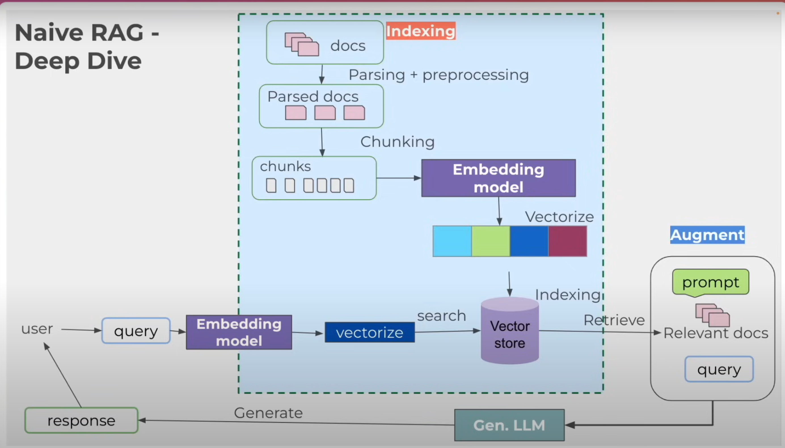

RAG（Retrieval-Augmented Generation）是一种结合信息检索和生成模型的技术，主要用于提高生成模型的回答质量。根据你提供的图片，RAG的流程可以分为几个主要步骤：

1. **文档处理（Parsing + Preprocessing）**:
   - 首先，输入的文档会经过解析和预处理。这一步骤确保文档格式一致，去除不必要的信息。

2. **分块（Chunking）**:
   - 经过处理的文档会被分成多个小块（chunks），这有助于后续的检索和嵌入。

3. **嵌入模型（Embedding Model）**:
   - 对这些分块进行向量化处理，使用嵌入模型将文本转化为向量表示。这些向量能够捕捉文本的语义信息。

4. **索引（Indexing）**:
   - 将生成的向量存储到向量数据库中，以便后续快速检索。

5. **用户查询（User Query）**:
   - 用户输入查询后，使用同样的嵌入模型对查询进行向量化。

6. **检索（Retrieve）**:
   - 在向量数据库中搜索与用户查询相关的文档块，找到最相关的块。

7. **增强（Augment）**:
   - 将检索到的相关文档与用户的查询结合，形成一个增强的提示（prompt），用于生成更准确的回答。

8. **生成响应（Generate Response）**:
   - 最后，使用生成模型（如大型语言模型）根据增强的提示生成最终的响应。

通过这种方式，RAG不仅能够利用已有的知识库，还能生成更具上下文相关性的回答，提高了模型的实用性和准确性。

